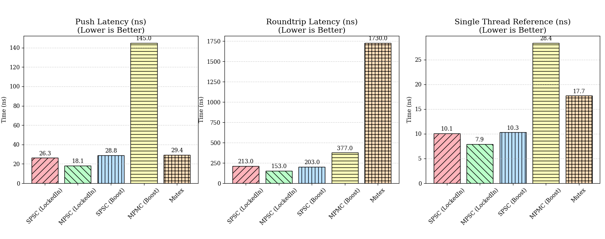
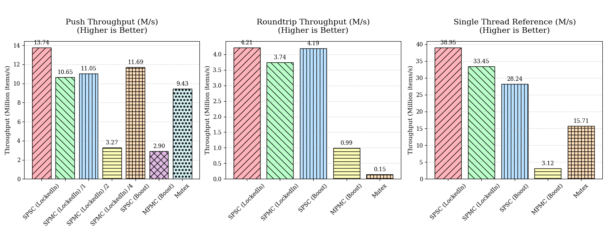

# Locked-In\! Lock-Free Data Structures



**Locked-In** is a header-only C++23 library providing bounded, lock-free queues optimized for low-latency systems. It uses C++20 Concepts and CRTP to enforce strict API contracts at compile time, ensuring zero runtime overhead and no virtual dispatch.

## Key Features

  * Bounded queues with $O(1)$ operations; no dynamic allocation after construction.
  * Critical indices and per-role cursors are aligned to separate cache lines to avoid false sharing.
  * Uses CRTP and Concepts to validate API correctness up front; accidental signature drift or misuse fails compilation immediately.
  * Optimized implementations for SPSC, MPSC, and SPMC patterns.

## Supported Queues

| Topology | Header | Description |
| :--- | :--- | :--- |
| **SPSC** | `lockedin/spsc_queue.hpp` | **Single-Producer / Single-Consumer.** A wait-free ring buffer using acquire/release semantics suitable for very low-latency hand-off. |
| **MPSC** | `lockedin/mpsc_queue.hpp` | **Multi-Producer / Single-Consumer.** Uses atomic CAS and per-slot sequence numbers to scale writers while preserving a single fast consumer path. |
| **SPMC** | `lockedin/spmc_queue.hpp` | **Single-Producer / Multi-Consumer.** Vends separate producer (push-only) and consumer (pop-only) handles. Supports overlap detection where slow consumers throw `std::runtime_error` if "lapped". |

## Usage Examples

### SPSC (Simple Ring)

SPSC operations are wait-free and utilize a monolithic interface.

```cpp
#include <lockedin/spsc_queue.hpp>

// Capacity must be a power of two
lockedin::SPSCQ<int> queue(1024);

// Producer Thread
// returns false if full; strictly non-blocking
while (!queue.push(42)) { 
    std::this_thread::yield(); 
}

// Consumer Thread
int value = 0;
// returns false if empty
if (queue.pop(value)) {
    process(value);
}
```

### SPMC (Shared Queue Interface)

SPMC enforces role separation via handles to ensure a consumer cannot push and a producer cannot pop.

```cpp
#include <lockedin/spmc_queue.hpp>

lockedin::SPMCQ<int> queue(64);

// Obtain handles
auto producer = queue.getProducer();
auto consumer = queue.getConsumer();

// Producer Thread
producer.push(1);

// Consumer Thread
try {
    int val;
    if (consumer.pop(val)) {
        // success
    }
} catch (const std::runtime_error&) {
    // Consumer was overlapped (lapped) by producer.
    // Realign to current head to recover.
    consumer.respawn(); 
}
```

## Build & Dependencies

### Prerequisites

  * **Compiler:** C++23 compliant (GCC 13+, Clang 16+, MSVC).
  * **Build System:** CMake 3.10+.

### Integration

Since the library is **header-only**, you can simply include the `include/lockedin` directory in your project.

To build the included examples and benchmarks:

```bash
mkdir build && cd build
# Build examples and benchmarks (requires internet to fetch Google Benchmark)
cmake -DLOCKEDIN_BUILD_EXAMPLES=ON -DLOCKEDIN_BUILD_BENCHMARKS=ON ..
cmake --build . -j
```

## Performance



The repository includes a performance harness comparing Locked-In against Boost lock-free queues and standard mutex-protected queues. Benchmarks cover call-site latency, round-trip throughput, and multi-consumer stress tests.

Run benchmarks after building:

```bash
./perf/google_benchmarks
```